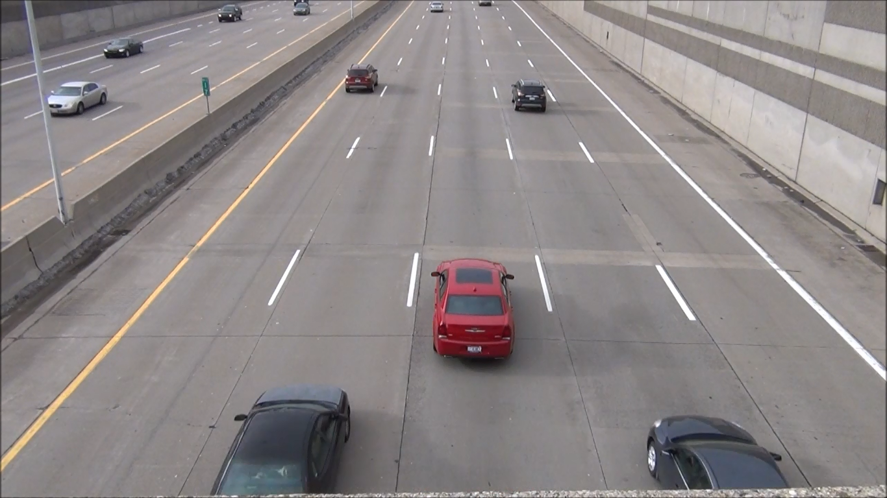
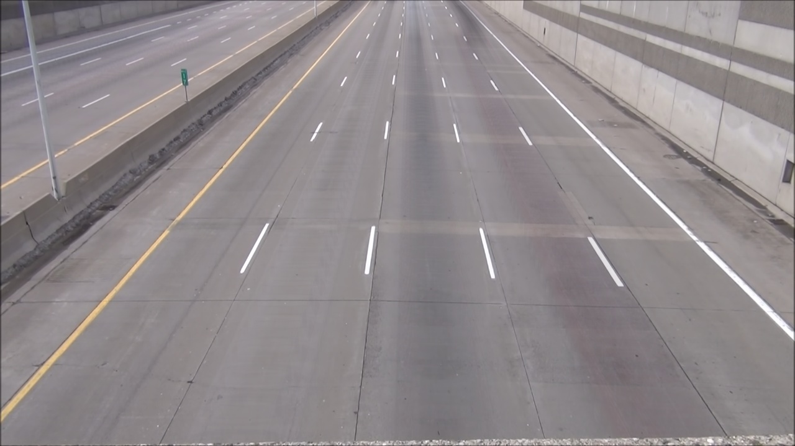

# Background Extraction From Video Stream

Background can be extracted from video sequence with fixed angle.


## Getting Started
Run program with below command.
`
python backgroundExtract.py --video video.mp4 --output background
`
Press `s` key to show and save background image that crated until that time.
Press `q` to exit the program
Press `c` to clear background image that create that time.

### Prerequisites

Install below libraries.

```
pip install opencv-python
pip install numpy
```

## Logic 

İt takes a mean of frames. So moving objects are deleted from the frame. Background can be extracted that way.
## Result


